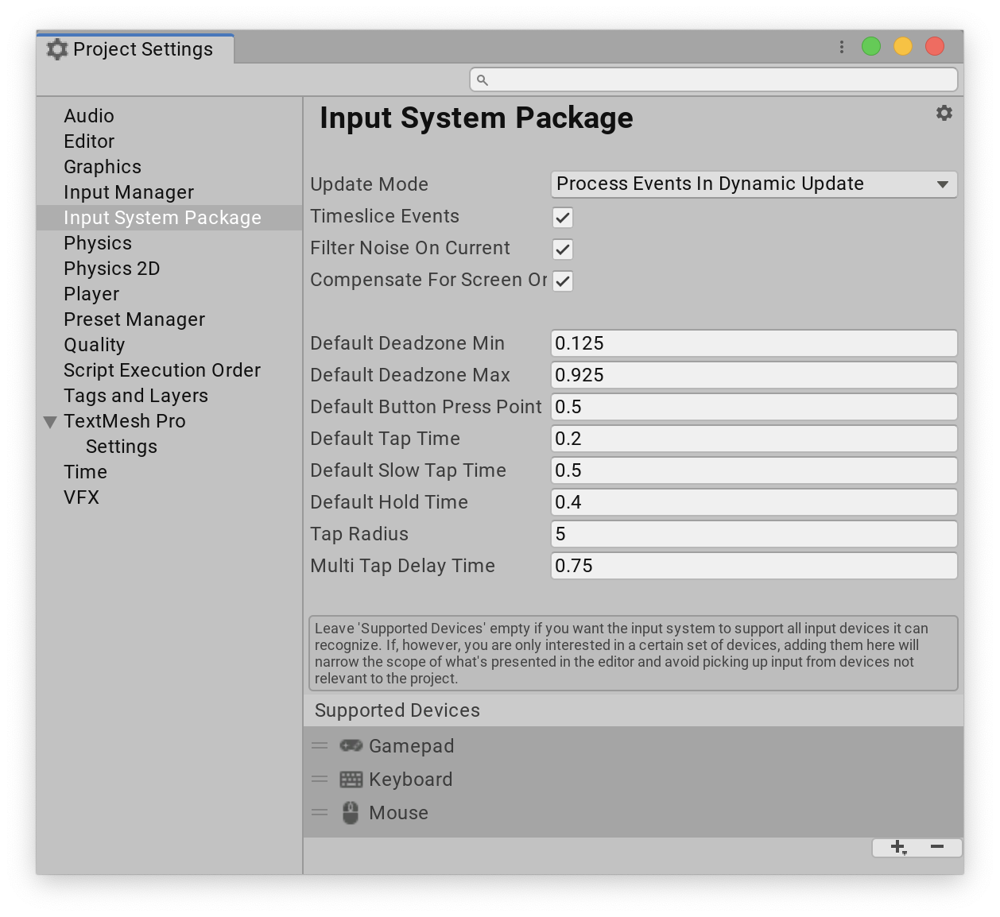
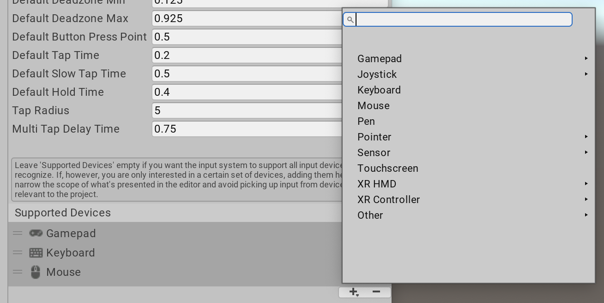
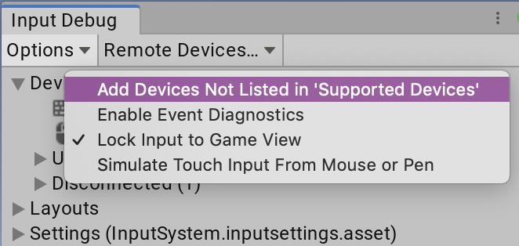

# Settings

The input system can be configured on a per-project basis by going to "Edit >> Project Settings..." and selecting "Input System Package".

Settings are stored in assets. If your project does not contain an Input settings asset, you can click `Create settings asset` in the settings window to create one. If your project contains multiple settings assets, you can use the gear menu in the top right of the window to chose which one to use (or to create more of them).

>NOTE: Modifications to settings are saved when the project is saved.

## Update Mode

This is a fundamental setting that determines when the input system processes input.

There are three distinct ways in which the input system processes input.

|Type|Description|
|----|-----------|
|[`Fixed Update`](../api/UnityEngine.InputSystem.InputSettings.UpdateMode.html)|Events are processed in intervals of fixed length. This corresponds to how [`MonoBehaviour.FixedUpdate`](https://docs.unity3d.com/ScriptReference/MonoBehaviour.FixedUpdate.html) operates. The length of each interval is determined by [`Time.fixedDeltaTime`](https://docs.unity3d.com/ScriptReference/Time-fixedDeltaTime.html).|
|[`Dynamic Update`](../api/UnityEngine.InputSystem.InputSettings.UpdateMode.html)|Events are processed in irregular intervals governed by the current framerate.|
|[`Manual Update`](../api/UnityEngine.InputSystem.InputSettings.UpdateMode.html)|Events are not processed automatically but instead are flushed out whenever the user calls [`InputSystem.Update()`](../api/UnityEngine.InputSystem.InputSystem.html#UnityEngine_InputSystem_InputSystem_Update).|

>NOTE: There are two additional types of updates performed by the system in the form of [`InputUpdateType.BeforeRender`](../api/UnityEngine.InputSystem.LowLevel.InputUpdateType.html) (late update for XR tracking devices) and [`InputUpdateType.Editor`](../api/UnityEngine.InputSystem.LowLevel.InputUpdateType.html) (for EditorWindows) but these do not fundamentally alter how input is consumed in an application.

## Filter Noise On Current

[//]: # (REVIEW: should this be enabled by default)

This setting is only relevant for a game that uses the various `.current` properties (like [`Gamepad.current`](../api/UnityEngine.InputSystem.Gamepad.html#UnityEngine_InputSystem_Gamepad_current)) in the API. If these aren't used, it's recommended to leave this setting turned off (the default) as it will otherwise add needless overhead.

Whenever there is input on a device, the system make the respective device `.current`. If, for example, a given [`Gamepad`](../api/UnityEngine.InputSystem.Gamepad.html) receives new input, it will assume the position of [`Gamepad.current`](../api/UnityEngine.InputSystem.Gamepad.html#UnityEngine_InputSystem_Gamepad_current).

However, some devices have noise in their input and thus need not be interacted with to receive input. An example is the PS4 DualShock controller which generates a constrant stream of input because of its built-in gyro. This means that if both an Xbox and a PS4 controller connected and the user is playing with the Xbox controller, the PS4 controller will still continuously push itself to the front and make itself current.

To counteract this, noise filtering can be enabled. If turned on, when input is received, the system will determine whether the input is for a device that has noisy controls ([`InputControl.noisy`](../api/UnityEngine.InputSystem.InputControl.html#UnityEngine_InputSystem_InputControl_noisy)). If it does, it will determine whether the given input contains any state change on a control that is __not__ marked as noisy. If so, the device will become current. If not, the input will still be consumed (and visible on the device) but the device will not be made current.

>NOTE: The system does not currently detect other forms of noise, principally those on gamepad sticks. This means that if the sticks are wiggled a little bit (and on most gameapds this does not require actually actuating the sticks; there will be a small tolerance within which the sticks will move when the entire device is moved) but are still within deadzone limits, the device will still be made current.

## Compensate For Screen Orientation

If enabled, rotation values will be rotated around Z. In [`ScreenOrientation.Portrait`](https://docs.unity3d.com/ScriptReference/ScreenOrientation.html), values remain unchanged. In [`ScreenOrientation.PortraitUpsideDown`](https://docs.unity3d.com/ScriptReference/ScreenOrientation.html), they will be rotated by 180 degrees. In [`ScreenOrientation.LandscapeLeft`](https://docs.unity3d.com/ScriptReference/ScreenOrientation.html) by 90 degrees, and in [`ScreenOrientation.LandscapeRight`](https://docs.unity3d.com/ScriptReference/ScreenOrientation.html) by 270 degrees.

Sensors affected by this setting are [`Gyroscope`](../api/UnityEngine.InputSystem.Gyroscope.html), [`GravitySensor`](../api/UnityEngine.InputSystem.GravitySensor.html), [`AttitudeSensor`](../api/UnityEngine.InputSystem.AttitudeSensor.html), [`Accelerometer`](../api/UnityEngine.InputSystem.Accelerometer.html) and [`LinearAccelerationSensor`](../api/UnityEngine.InputSystem.LinearAccelerationSensor.html).

## Default Value Properties

|Property|Description|
|----|-----------|
|Default Deadzone Min|Default minimum value used for [Stick Deadzone](Processors.md#stick-deadzone) or [Axis Deadzone](Processors.md#axis-deadzone) processors when no min value is explicitly set on the processor|
|Default Deadzone Max|Default maximum value used for [Stick Deadzone](Processors.md#stick-deadzone) or [Axis Deadzone](Processors.md#axis-deadzone) processors when no max value is explicitly set on the processor|
|Default Button Press Point|The default [press point](../api/UnityEngine.InputSystem.Controls.ButtonControl.html#UnityEngine_InputSystem_Controls_ButtonControl_pressPointOrDefault) used for [Button controls](../api/UnityEngine.InputSystem.Controls.ButtonControl.html). For button controls which have analog physics inputs (such as triggers on a gamepad), this configures how far they need to be held down to be considered "pressed".|
|Default Tap Time|Default duration to be used for [Tap](Interactions.md#tap) and [MultiTap](Interactions.md#multitap) interactions. Also used by by Touch screen devices to distinguish taps from to new touches.|
|Default Slow Tap Time|Default duration to be used for [SlowTap](Interactions.md#tap) interactions.|
|Default Hold Time|Default duration to be used for [Hold](Interactions.md#hold) interactions.|
|Tap Radius|Maximum distance between two finger taps on a touch screen device allowed for the system to consider this a tap of the same touch (as opposed to a new touch).|
|Multi Tap Delay Time|Default delay to be allowed between taps for [MultiTap](Interactions.md#multitap) interactions. Also used by by touch devices to count multi taps (See [`TouchControl.tapCount`](../api/UnityEngine.InputSystem.Controls.TouchControl.html#UnityEngine_InputSystem_Controls_TouchControl_tapCount)).|

## Supported Devices

Usually, a given project will support a known set of input methods. For example, a mobile title might support only touch whereas a console application may support only gamepads. A cross-platform title might support gamepads, mouse, and keyboard, but may have no use for XR devices, for example.

To narrow the options presented to you in the editor UI as well as to avoid creating input devices and consuming input that will not be used, the set of supported devices can be restricted on a per-project basis.

If `Supported Devices` is empty, no restrictions will be applied. Meaning that any device recognized by Unity will be added to the system and will have input consumed for it. If, however, `Support Devices` contains one or more entries, than only devices that are of one of the listed types will be added to the system.

Note that as this setting is changed, the system will remove or re-add devices as needed. Information about what devices are available for potential use is always retained meaning that no device is permanently lost as long as it is connected.

To add devices to the list, click the plus icon and choose a device from the picker.

`Abstract Devices` contains common device abstractions such as "Keyboard" and "Mouse" whereas `Specific Devices` contains specific hardware products.

### Override in Editor

In the editor, it can be undesirable to restrict input devices to those supported by the game. For example, one might want to use a tablet in the editor even if the game being developed only supports gamepads.

To force the editor, to add all locally available devices even if they are not in the list of `Supported Devices`, open the [Input Debugger](Debugger.md) (`Window >> Analysis >> Input Debugger`), click `Options`, and select `Add Devices Not Listed in 'Supported Devices'`.

This setting will be persisted as a user setting (i.e. the setting will not be visible to other users that have the same project open).
