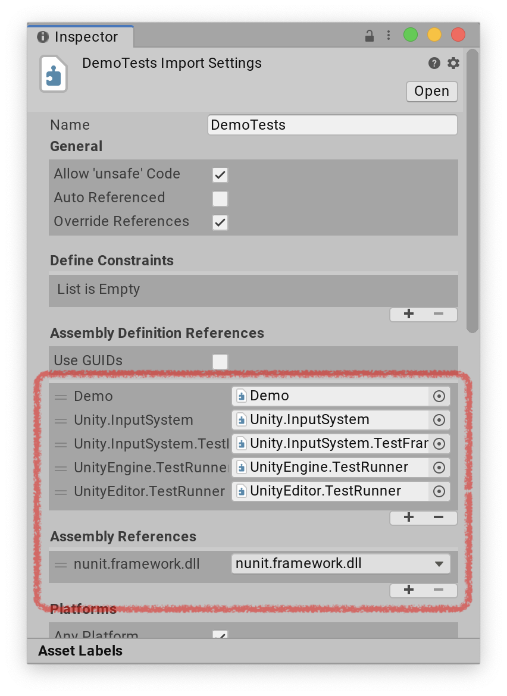

# Testing Input

The input system has built-in support for writing automated tests involving input. This makes it possible to drive input entirely from code without dependencies on platform backends and actual hardware devices. To the tests, the generated input will look identical to input generated at runtime by actual platform code.

## Setting Up Test Assemblies

Using test support requires setting up a test assembly for your tests. To do so, create a new assembly definition ("Create >> Assembly Definition") and add references to `nunit.framework.dll`, `UnityEngine.TestRunner`, and `UnityEditor.TestRunner` (as described [here](https://docs.unity3d.com/Packages/com.unity.test-framework@1.0/manual/workflow-create-test-assembly.html)) as well as `UnityEngine.Input.dll` and `UnityEngine.Input.TestFramework.dll` for the input system.

    ////TODO: Needs updated screenshot


## Setting Up Test Fixtures

Use `InputTestFixture` to create an isolated version of the input system for tests. The fixture will set up a blank, default-initialized version of the input system for each test and restore the prior input system state after completion of the test. The default-initialized version has all built-in layout, processor, etc. registrations but has no pre-existing input devices. In addition, the fixture uses a custom `IInputRuntime` implementation (available from the `runtime` property of the fixture) in place of `NativeInputRuntime`.

The fixture can either be used as a base class for your own fixture:

```CSharp
class MyTests : InputTestFixture
{
    [Test]
    public void CanPressButtonOnGamepad()
    {
        var gamepad = InputSystem.AddDevice<Gamepad>();
        Press(gamepad.buttonSouth);
    }
}
```

Or it can be instantiated in your fixture:

```CSharp
[TestFixture]
class MyTestFixture
{
    private InputTestFixture input = new InputTestFixture();
}
```

This is especially useful when creating a larger setup for game testing using `PrebuiltSetup`.

```CSharp
[PrebuildSetup("GameTestPrebuildSetup")]
public class GameTestFixture
{
    public Game game { get; set; }
    public InputTestFixture input { get; set; }

    public Mouse mouse { get; set; }
    public Keyboard keyboard { get; set; }
    public Touchscreen touchscreen { get; set; }
    public Gamepad gamepad { get; set; }

    //...
}

#if UNITY_EDITOR
public class GameTestPrebuildSetup : IPrebuildSetup
{
    public void Setup()
    {
        UnityEditor.EditorBuildSettings.scenes = new[]
        {
            new UnityEditor.EditorBuildSettingsScene("Assets/Scenes/Main.unity", true)
        };
    }
}
#endif
```

## Writing Tests

In tests, use `InputSystem.AddDevice<T>()` to add new devices.

```CSharp
    [Test]
    public void PlayerInput_CanInstantiatePlayer_WithSpecificControlScheme()
    {
        InputSystem.AddDevice<Gamepad>();
        var keyboard = InputSystem.AddDevice<Keyboard>();
        var mouse = InputSystem.AddDevice<Mouse>();

        var prefab = new GameObject();
        prefab.SetActive(false);
        var prefabPlayerInput = prefab.AddComponent<PlayerInput>();
        prefabPlayerInput.actions = InputActionAsset.FromJson(kActions);

        var player = PlayerInput.Instantiate(prefab, controlScheme: "Keyboard&Mouse");

        Assert.That(player.devices, Is.EquivalentTo(new InputDevice[] { keyboard, mouse }));
        Assert.That(player.controlScheme, Is.EqualTo("Keyboard&Mouse"));
    }
```

To feed input, the easiest way is to use the `Press(button)`, `Release(button)`, `PressAndRelease(button)`, `Set(control,value)`, and `Trigger(action)` helper functions provided by `InputTestFixture`.

```CSharp
    [Test]
    public void Actions_WhenDisabled_CancelAllStartedInteractions()
    {
        var gamepad = InputSystem.AddDevice<Gamepad>();

        var action1 = new InputAction("action1", binding: "<Gamepad>/buttonSouth", interactions: "Hold");
        var action2 = new InputAction("action2", binding: "<Gamepad>/leftStick");

        action1.Enable();
        action2.Enable();

        Press(gamepad.buttonSouth);
        Set(gamepad.leftStick, new Vector2(0.123f, 0.234f));

        using (var trace = new InputActionTrace())
        {
            trace.SubscribeTo(action1);
            trace.SubscribeTo(action2);

            runtime.currentTime = 0.234f;
            runtime.advanceTimeEachDynamicUpdate = 0;

            action1.Disable();
            action2.Disable();

            var actions = trace.ToArray();

            Assert.That(actions.Length, Is.EqualTo(2));
            //...
        }
    }
```

Alternatively, arbitrary input events can be fed into the system and arbitrary input updates can be run by code.

```CSharp
    [Test]
    public void PlayerInput_JoiningPlayerThroughButtonPress_WillFailIfDeviceIsNotUsableWithPlayerActions()
    {
        var playerPrefab = new GameObject();
        playerPrefab.SetActive(false);
        playerPrefab.AddComponent<PlayerInput>();
        playerPrefab.GetComponent<PlayerInput>().actions = InputActionAsset.FromJson(kActions);

        var manager = new GameObject();
        var listener = manager.AddComponent<MessageListener>();
        var managerComponent = manager.AddComponent<PlayerInputManager>();
        managerComponent.joinBehavior = PlayerJoinBehavior.JoinPlayersWhenButtonIsPressed;
        managerComponent.playerPrefab = playerPrefab;

        // Create a device based on the HID layout with a single button control.
        const string kLayout = @"
            {
                ""name"" : ""TestDevice"",
                ""extend"" : ""HID"",
                ""controls"" : [
                    { ""name"" : ""button"", ""layout"" : ""Button"" }
                ]
            }
        ";

        InputSystem.RegisterLayout(kLayout);
        var device = InputSystem.AddDevice("TestDevice");

        using (StateEvent.From(device, out var eventPtr))
        {
            ((ButtonControl)device["button"]).WriteValueIntoEvent(1f, eventPtr);
            InputSystem.QueueEvent(eventPtr);
            InputSystem.Update();
        }

        Assert.That(listener.messages, Is.Empty);
        Assert.That(PlayerInput.all, Is.Empty);
    }
```

>NOTE: For reference, the tests for the input system itself can be found [here](https://github.com/Unity-Technologies/InputSystem/tree/stable/Assets/Tests/InputSystem).
